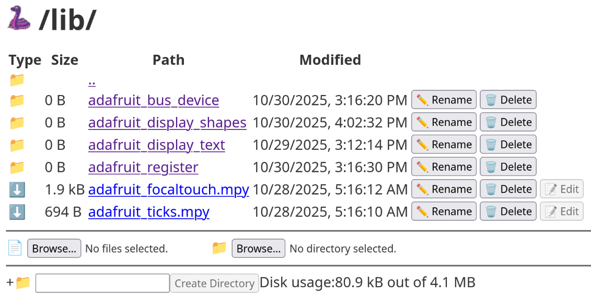

# CircuitPython for ThingPulse Color Kit Grande

This repository contains code to use the display and touch device of the ESP32-based [ThingPulse Color Kit Grande](https://thingpulse.com/product/esp32-wifi-color-display-kit-grande/) using the board image [ESP32-DevKitC-VE-WROVER](https://circuitpython.org/board/espressif_esp32_devkitc_v4_wrover/) which is a close match to this product.

## License

This repository and its code is licensed under MIT license.

## CircuitPython library dependencies

In order to run all the files, some CircuitPython libraries are required.

Unfortunately, you cannot use the CircUp tool to upload the libraries because this device does not have native USB support. Instead, you must upload them manually. On the [CircuitPython Libraries](https://circuitpython.org/libraries) page, download the bundle for your CircuitPython version (10.x at time of writing) and unzip the file to a directory of your choice. Go to http://circuitpython.local/fs/ and create a folder `lib` if it does not already exist. In the lib folder, use the file upload and folder upload buttons (they are titled "Browse..." with a file or folder icon beside them) to upload the following:

* `adafruit_focaltouch.mpy`
* `adafruit_ticks.mpy`
* folder `adafruit_bus_device`
* folder `adafruit_display_shapes`
* folder `adafruit_display_text`
* folder `adafruit_register`

The folder will look like this: 
